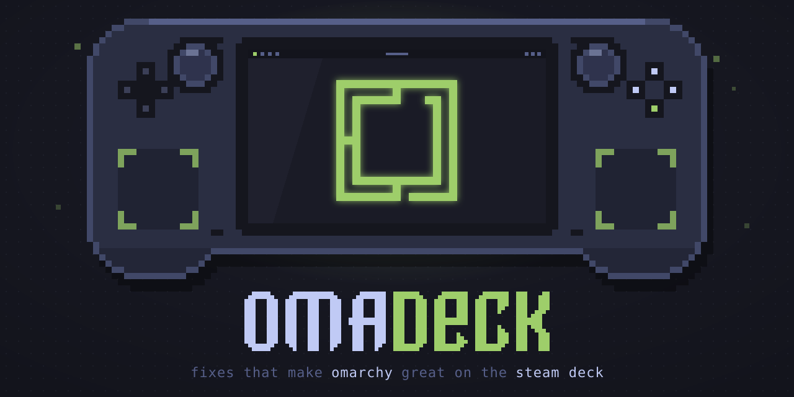
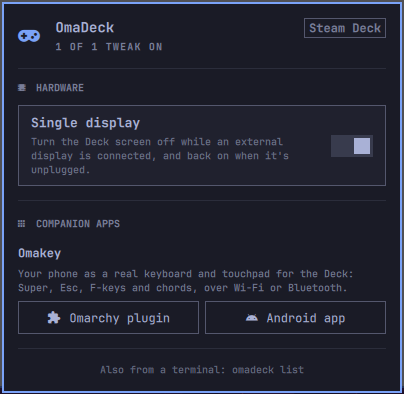

<p align="center">
  
</p>

# OmaDeck

**Fixes and tweaks that make [Omarchy](https://omarchy.org/) great on the Steam Deck.**

Omarchy works on the Steam Deck, but a few things feel like a laptop rather than a handheld you dock to a big screen. OmaDeck fixes them with one copy-paste command. Every fix stays inside your own `~/.config` and can be removed again.

## Install

Open a terminal on your Deck (in Omarchy's desktop session) and paste:

```bash
curl -fsSL https://raw.githubusercontent.com/gladimdim/OmaDeck/main/install.sh | bash
```

You don't need to log out: fixes take effect right away. Run the same command again any time to update OmaDeck and pick up new fixes. Running it more than once is safe, and fixes you switched off stay off.

## Control panel

OmaDeck adds a gamepad icon to your Omarchy bar. Click it to see every tweak, grouped by category, and switch each one on or off. Below the tweaks, **Companion apps** links apps that go well with a Deck, starting with [Omakey](#omakey-your-phone-as-the-decks-keyboard).

<p align="center">
  
</p>

It follows your Omarchy theme and works from the keyboard: arrow keys move between tweaks, Enter flips one, Esc closes.

The same controls work from a terminal:

```text
omadeck list               Show every tweak and whether it's on
omadeck enable <tweak>     Turn a tweak on
omadeck disable <tweak>    Turn a tweak off (stays off when OmaDeck updates)
```

## Tweaks

### Hardware

#### 🖥️ Single display

Works like Windows' *"Show only on 2"*: you use one screen at a time.

| You do this | OmaDeck does this |
| --- | --- |
| Plug in a monitor or TV | The Deck screen turns off and the external display gets all your windows and workspaces |
| Unplug it | The Deck screen turns back on, with the rotation and scale from your own `monitors.lua` |

A small listener (`~/.local/bin/omadeck-display-switch`) watches Hyprland's monitor events. It starts at login from `~/.config/hypr/autostart.lua`. It doesn't hard-code anything about your panel: to turn the Deck screen back on, it reloads your Hyprland config. Gaming Mode is unaffected.

### Input

#### 🎮 Back buttons scroll

The four back buttons work as a mouse wheel, so you can read a long page without reaching for the trackpad.

| Button | Does |
| --- | --- |
| L4, R4 (upper) | Scroll up |
| L5, R5 (lower) | Scroll down |

Tap for one notch, or hold to keep scrolling. A small helper (`~/.local/bin/omadeck-back-scroll`) reads the buttons and scrolls through a virtual mouse called *OmaDeck back buttons*. It starts at login from `~/.config/hypr/autostart.lua`.

It steps aside when something else needs the controller:

- **Steam is open**: Steam takes over the controller, and its own desktop layout applies until you quit Steam.
- **Gamepad mode for non-Steam games**: hold ☰ (Options) for about a second to switch the Deck into gamepad mode, the same as without OmaDeck. Hold it again to switch back, and the back buttons scroll again.

It needs the kernel's default controller setup, where the right trackpad moves the mouse (`hid_steam` with `lizard_mode` on). If another program has turned that off to drive the controller itself, the helper waits and does nothing.

*More fixes coming.*

## Companion apps

### Omakey: your phone as the Deck's keyboard

A docked Deck needs a keyboard, and the on-screen one can't hold `SUPER + SPACE`. [Omakey](https://gladimdim.github.io/omakey-omarchy-plugin/) turns an Android phone into a real keyboard and touchpad: Super, Esc, F1–F12, arrows and any chord, over Wi-Fi or Bluetooth, encrypted. It's a kernel-level device, so Hyprland binds, games and the lock screen all see real key presses. Layouts include laptop QWERTY, Colemak, Dvorak and split boards like the Corne and ErgoDox.

On Omarchy, add the plugin and its service with one command:

```bash
omarchy plugin add https://github.com/gladimdim/omakey-omarchy-plugin --enable && ~/.config/omarchy/plugins/gladimdim.omakey/install.sh
```

Then install the [Android app (latest APK)](https://github.com/gladimdim/omakey-mobile/releases/latest) on your phone and pair it from the keyboard icon in the bar. On a stock SteamOS Deck, Omakey has its own [rootless installer](https://github.com/gladimdim/omakey-omarchy-plugin#steam-deck-with-steamos) that works in Game Mode too.

Links: [Omarchy plugin](https://github.com/gladimdim/omakey-omarchy-plugin) · [Android app](https://github.com/gladimdim/omakey-mobile/releases/latest) · [Website](https://gladimdim.github.io/omakey-omarchy-plugin/) · [Omarchy plugin marketplace](https://omarchyplugins.com/plugin.html?id=gladimdim.omakey)

## Uninstall

```bash
omadeck uninstall
```

This turns every tweak off, removes OmaDeck's lines from your config and the bar plugin, and turns the Deck screen back on. To remove the downloaded copy too, delete `~/.local/share/omadeck`.

## Installer options

```text
install.sh [--uninstall] [--force] [--list]

  --uninstall  Turn every tweak off and remove OmaDeck
  --force      Install on hardware that is not a Steam Deck
  --list       Show the available tweaks and exit
```

## Requirements

- A Steam Deck, LCD or OLED. The installer checks for this and refuses to run on anything else unless you pass `--force`.
- Omarchy with Hyprland's Lua config (Hyprland 0.55 or newer, `~/.config/hypr/hyprland.lua`).
- `git`, `socat` and `jq`. Omarchy ships all three, and the installer adds `socat` or `jq` if either is missing.
- `python3` and `steam-devices` for *Back buttons scroll*. `steam-devices` comes with Steam; if it's missing, the installer adds it, because it gives your user access to the controller.

## What it changes

OmaDeck only touches your user account. It never edits `/usr/share/omarchy`, so `omarchy update` can't undo it.

| Path | Purpose |
| --- | --- |
| `~/.local/share/omadeck/` | The downloaded copy of this repo |
| `~/.local/bin/omadeck` | The `omadeck` command (a link into the copy above) |
| `~/.local/bin/omadeck-*` | Helper scripts installed by tweaks |
| `~/.config/omarchy/plugins/gladimdim.omadeck/` | The bar plugin |
| `~/.config/omadeck/disabled` | Tweaks you switched off |
| `~/.config/hypr/*.lua` | Small blocks between `-- >>> omadeck: <tweak> >>>` markers |

Re-running the installer replaces those marked blocks instead of adding copies, and uninstalling removes them.

## Adding a tweak

Each tweak is a folder in `fixes/` with a `fix.sh` that the `omadeck` command sources. The folder name is the tweak's id:

```bash
FIX_NAME="My tweak"
FIX_CATEGORY="Hardware"   # the panel groups tweaks by this
FIX_DESCRIPTION="One sentence about what it does."

# Exit 0 when the tweak is on. The panel's toggle shows this.
fix_status() {
  has_lua_block "$HOME/.config/hypr/looknfeel.lua" my-tweak
}

fix_install() {
  # Idempotent: running it twice must give the same result as running it once.
  put_lua_block "$HOME/.config/hypr/looknfeel.lua" my-tweak 'hl.config({ ... })'
  ok "Done"
}

fix_uninstall() {
  remove_lua_block "$HOME/.config/hypr/looknfeel.lua" my-tweak
}
```

A new category shows up in the panel as soon as a tweak uses it. Tweaks run in alphabetical order, each in its own subshell with `set -e`. Inside `fix.sh` you can use:

- `$FIX_DIR`: the tweak's folder
- `info`, `ok`, `warn`: output helpers
- `put_lua_block`, `remove_lua_block`, `has_lua_block`: add, remove or check a marked config block
- `in_hyprland`: true when a Hyprland session is running

To test your changes, run `./install.sh` from your clone. It uses the clone directly, doesn't download anything, and points the `omadeck` command at your clone. The bar plugin's source is in `plugin/`, and setup copies it into place.
